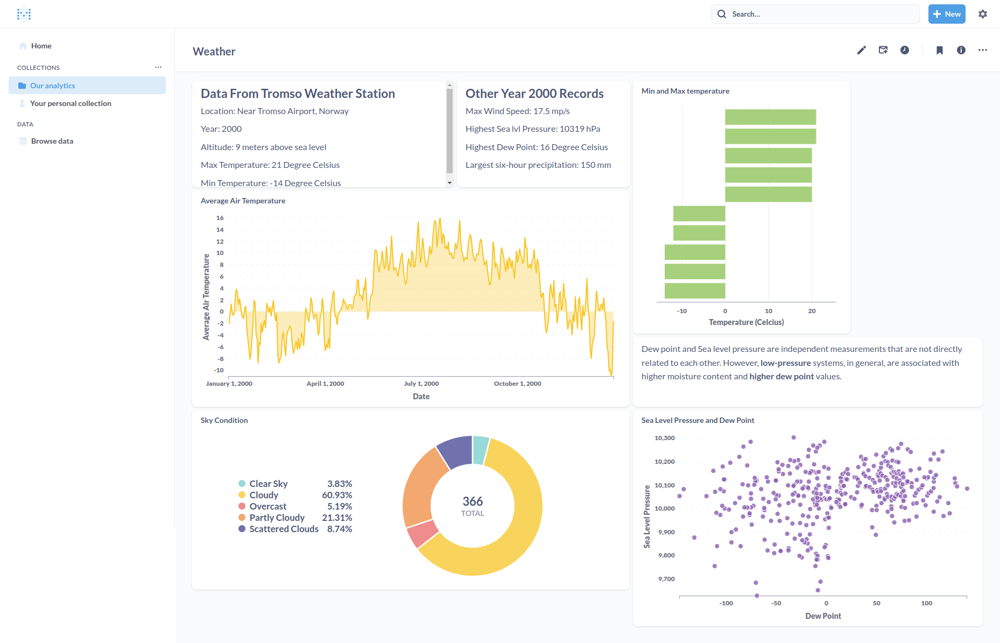
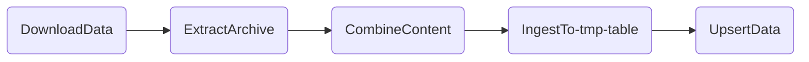

# Weather Data Pipeline

This project is a data pipeline for [NOAA Integrated Surface Database (ISD)](https://www.ncei.noaa.gov/products/land-based-station/integrated-surface-database) which is a part of [NOAA Big Data Program](https://registry.opendata.aws/collab/noaa/). The Integrated Surface Database (ISD) consists of global hourly and synoptic observations compiled from numerous sources into a gzipped fixed width format. It is hosted in multiple Cloud Service Providers, but our target for this project is hosted in AWS S3 that can be found in [this link](https://registry.opendata.aws/noaa-isd/).

## Dashboard

## ETL

This is an ***Extract-Load-Transform*** project. 

The objects in the NOAA bucket are in `.gz` archive format. They are downloaded using the [boto3](https://boto3.amazonaws.com/v1/documentation/api/latest/index.html) library, the AWS Software Development Kit for Python to interact with AWS services (e.g. Amazon S3). 

Inside each archive is the text-based file containing the hourly weather records like temperature, dew point, sea level pressure, and many more. There are around 13,000 files. Manipulating each one by one will cause too much overhead. Thus, they are concatenated by 500 into text files.

The text files will be ingested into a temporary table in PostgreSQL database before being processed. Transformation procedures include aggregating the datapoints (e.g. average temperature of the day instead of multiple hourly records). 

An interactive dashboard with Metabase providing real-time visualizations and analytics is also designed.

All of this is orchestrated through [Apache Airflow](https://airflow.apache.org/)

## Setup

**Pre-requisites**: Docker

- Clone the project and `cd Weather-Data-Pipeline/`
- Create a `.env` file and write variables based on the values of `sample.env`
  - Feeling lazy? Simply rename `sample.env` to `.env`

- Build and run. 
  - `docker compose build`
    - **Note:** This is only needed at the first run
  - `docker compose up -d`
    - **Note:** First run will take a few minutes due to downloading the services' image
- Airflow web server: http://localhost:8080
- Shut down
  - `docker compose down`

**Further development**:

- Create a virtual environment and activate it
  - `python -m venv venv`
  - `source venv/bin/activate`
- Install the dependencies
  - `pip install -r requirements.txt`
- Install Apache Airflow 
  - `pip install "apache-airflow=={AIRFLOW-VERSION}" --constraint "https://raw.githubusercontent.com/apache/airflow/constraints-{AIRFLOW-VERSION}/constraints-{PYTHON-VERSION}.txt"`
  - Airflow version in Dockerfile and Python version in `python --version`. 
  - Example: `pip install "apache-airflow==2.3.0" --constraint "https://raw.githubusercontent.com/apache/airflow/constraints-2.3.0/constraints-3.8.txt"`

​	